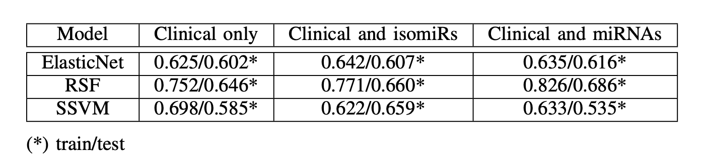

# isomiRs vs miRNAs in Prognosis for Head and Neck Cancer

## Author

Emma Nguyen 

## Description
In oncology, survival analysis is a crucial statistical technique that estimates the time to an event of interest, especially death and recurrence of cancer. This analysis helps us identify high-risk patients and reveals prognostic biomarkers that could serve as therapeutic targets. Many studies have shown the strong relationship between patients’ biological characteristics and survival time, which yields accurate survival time prediction models. The most common predictors that have been investigated throughout history are clinical variables including age, gender, TNM stage, grade, lymph ratio, etc. Recently, the breakthrough in high-throughput technologies paved a way for researchers to uncover the impact of molecular profiles such as genomic, transcriptomic, proteinomic, and metabolomic on survival time of patients. Thus, the immediate objective of this research project is to assess the prognostic accuracy of isomiRs on Head and Neck Squamous Cell Carcinoma (HNSC) and compare it with that of miRNAs, using a range of machine learning and statistical methods.

## Data retrieval and preprocessing
569 isoform expression quantification files and 569 miRNA expression quantification of HNSC patients were downloaded from The Cancer Genome Atlas (TCGA). Each dataset is a quantification of all isomiRs or miRNAs found in a HNSC cancer patient. There are 523 patients with Primary Tumor samples. Among these 523 patients, 43 patients also have Normal Solid Tissue samples, and 2 patients also have Metastatic samples. Only one patient has his/her Normal Solid Tissue sample. As a result, there 569 files in total.

Patients’ clinical data including 158 characteristics was also obtained from TCGA. However, only 13 characteristics (age at index, gender, race, ajcc clinical m, ajcc clinical n, ajcc clinical stage, ajcc clinical t, ajcc pathologic n, ajcc pathologic stage, ajcc pathologic t, prior malignancy, site of resection or biopsy, tissue or organ of origin) were retained as model predictors and three characteristics (vital status, days to death, days to last follow up) were retained as a model target, while the rest were removed due to their great number of missing values.

## Feature selection 
A workflow of feature selection:
1. Deseq2 differential expression: Identify isomiRs whose expressions are significantly different between normal tissues and primary tumour tissues (| logFC | >1.5 and p-adj <0.05).
2. The dominant isomiRs that present in at least 80% of samples were retained.
3. Retain a set of isomiRs with coefficient > 0 when fitting a multivariate Cox regression model. 
4. Retain a set of important features when fitting to Random Survival Forest. 
5. Retain a set of important features when fitting to Support Vector Survival Machine. 
6. Selected isomiRs are ones that present in at least 2 sets.

The exact same workflow was also applied to find the set of selected miRNAs.

## Model training and evaluation 
To compare the prognostic values of isomiRs and miRNAs, three types of feature set were used:

1. Clinical only

2. Clinical & selected miRNAs 

3. Clinical & selected isomiRs

C-index was used as a metric evaluate the performance of survival models. Significance of performance improvement of the clinical & miRNAs or clinical & isomiRs models over the clinical only model was assessed based on signed rank tests of their C-index scores on six train/test splits.

## Result

There is no strong evidence that survival models using combination of clinical and genetic factors are better than those using clinical factors only. Furthermore, there is no conclusive proof that isomiRs are more effective than miRNAs in improving the performance of these survival models when used in conjunction with clinical data (Table II).

